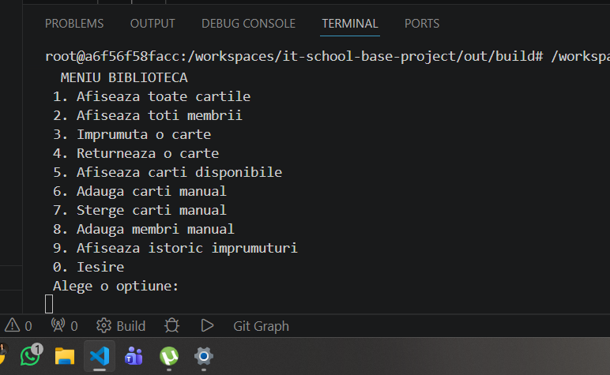
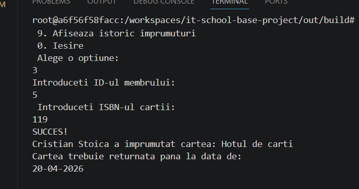
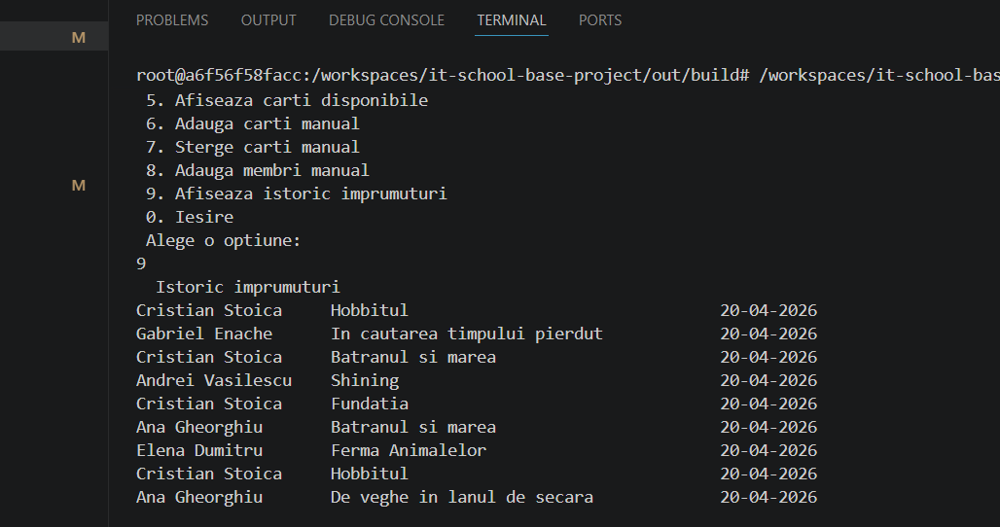
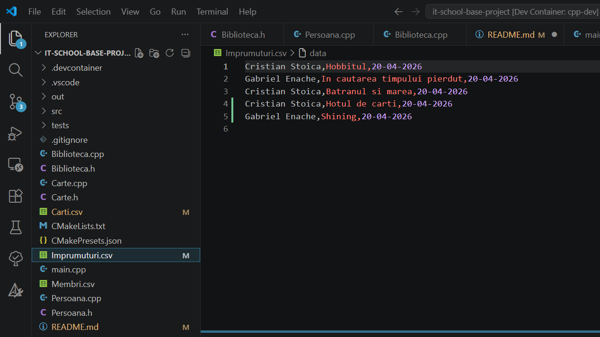
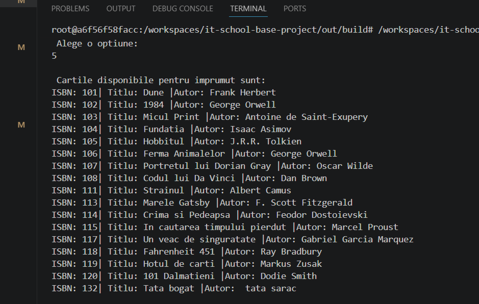
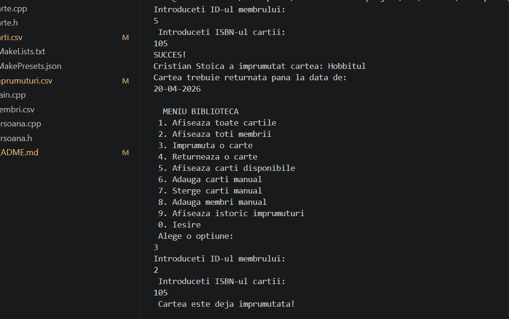
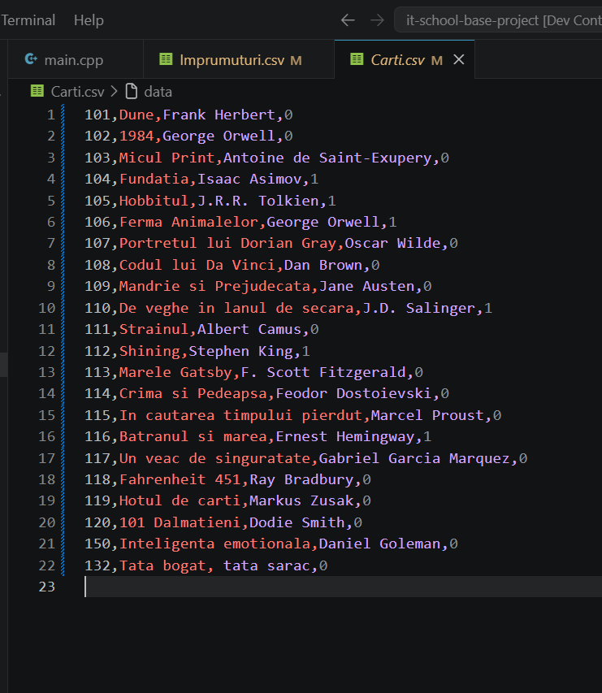
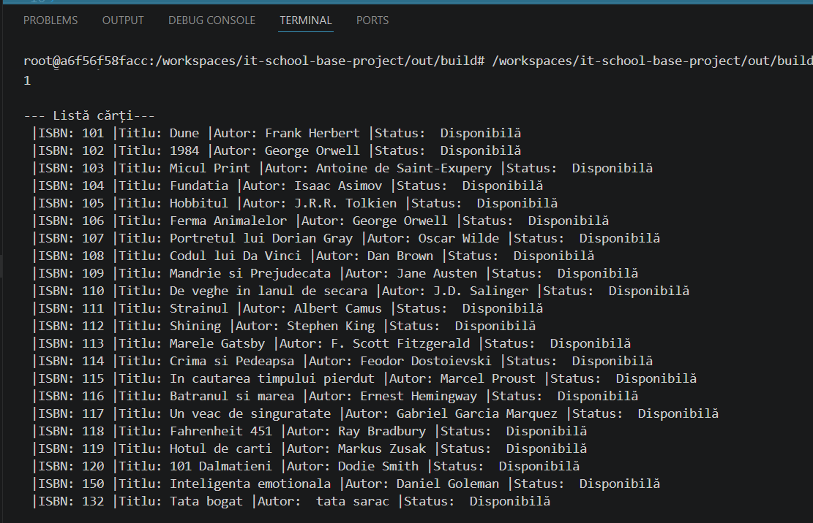
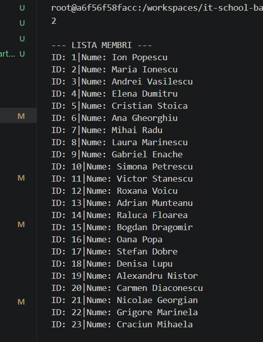

# 📚 Sistem de Gestiune Bibliotecă (Proiect Portofoliu C++)

## 📝 Descrierea Proiectului
Acest proiect reprezintă o aplicație de tip consolă dezvoltată în C++ pentru gestionarea fluxului de activitate dintr-o bibliotecă. Scopul principal este automatizarea procesului de evidență a inventarului de cărți, a membrilor înregistrați și a tranzacțiilor de împrumut/returnare. 

Aplicația pune accent pe utilizarea conceptelor moderne de Programare Orientată pe Obiect (POO) și pe persistența datelor prin utilizarea fișierelor externe, asigurând un sistem stabil și ușor de utilizat pentru personalul bibliotecii.

---

## 🚀 Funcționalități Implementate

### 1. Gestionarea Inventarului
* **Încărcare Automată:** La pornire, aplicația citește datele din `Carti.csv`.
* **Afișare Detaliată:** Listarea tuturor cărților cu detalii despre Titlu, Autor, ISBN și Status (Disponibil/Împrumutat).
* **Căutare:** Identificarea rapidă a unei cărți în inventar pe baza codului ISBN.

### 2. Gestionarea Membrilor
* **Bază de Date Membri:** Evidența persoanelor înregistrate, încărcată din `Membri.csv`.
* **Identificare unică:** Fiecare membru este gestionat printr-un ID numeric unic.

### 3. Logica de Împrumut și Returnare
* **Împrumut:** Proces de legare a unei cărți de un membru. Se verifică disponibilitatea cărții înainte de tranzacție.
* **Calcul Automată Dată Scadentă:** Aplicația calculează automat termenul de returnare la **14 zile** de la data curentă folosind biblioteca `<ctime>`.
* **Returnare:** Schimbarea statusului cărții în "Disponibil" și actualizarea bazei de date.

### 4. Persistența Datelor și Jurnalizare (Audit Log)
* **Actualizare în timp real:** Orice modificare de status este salvată imediat în `Carti.csv`.
* **Istoric Separat:** Toate împrumuturile sunt salvate într-un fișier separat, `Imprumuturi.csv`, creând un jurnal permanent de activitate.

---

## 📸 Screenshot-uri

### Meniul Principal

*Interfața interactivă de navigare a aplicației.*

### Procesul de Împrumut și Calculul Datei

*Exemplu de împrumut reușit cu afișarea numelui și a datei limită.*

### Lista de Inventar

*Afișarea tabelară a cărților folosind formatare precisă.*

### Istoricul Împrumuturilor (Din fișier separat)

*Vizualizarea jurnalului de activitate stocat în Imprumuturi.csv.*

### Afișare disponibilitate cărți

*Vizualizarea în consolă a cărților disponibile.*

### Afișare automata eroare disponibilitate cărți

*Primirea notificării "Cartea este deja împrumutată!", citind statusul din Carti.csv.*

### Schimbare automat status cărți

*Vizualizarea în fișierul Carti.csv a statusului 0 sau 1.*

### Afișare lista cărților din bibliotecă

*Afișarea în consolă a tuturor cărților din bibliotecă.*

### Afișare lista membrilor

*Afișarea în consolă a tuturor membrilor înscriși în bibliotecă.*

---

## 🛠️ Detalii Tehnice
* **Limbaj:** C++ (Standard 11/14/17).
* **Gestiune Memorie:** `std::unique_ptr` și containere STL (`std::vector`).
* **Format Date:** Comma-Separated Values (CSV).
* **Structura:** Arhitectură modulară (fișiere `.h` și `.cpp` separate).
